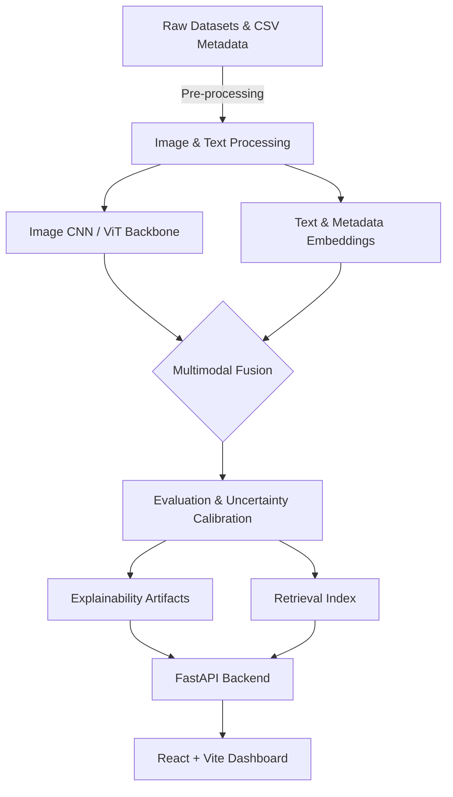

<div align="center">
  <h1>🧠 NeuroVisionLab</h1>
  <p><strong>A Full-Stack Multimodal Medical AI Research Platform</strong></p>
  <p>
    <a href="#key-features"></a>
    <a href="#tech-stack"></a>
    <a href="#tech-stack"></a>
    <a href="#tech-stack"></a>
    <a href="#license"></a>
  </p>
</div>

## 📖 Overview

**NeuroVisionLab** is a comprehensive, open-source educational platform designed to showcase the end-to-end lifecycle of a medical AI model. It bridges the gap between raw data and a deployed clinical decision support prototype (for research only), highlighting best practices in multimodal data fusion, model explainability, calibration, and governance.

> **⚠️ Disclaimer:** This project is an **educational and research demo only**. Outputs are not medical advice, not a diagnosis, and are strictly not intended for clinical use.

## ✨ Key Features

- **Multimodal AI Pipeline:** Fuses image features, clinical free-text notes, and structured metadata into a single coherent model.
- **Model Explainability (XAI):** Generates interpretable artifacts such as GradCAM-style heatmaps, visual overlays, and top predicted feature lists to demystify neural network decisions.
- **Uncertainty & Calibration:** Flags high-uncertainty predictions and provides calibration curves/Expected Calibration Error (ECE) metrics.
- **Similar-Case Retrieval:** Uses structural embeddings and cosine similarity (via FAISS/scikit-learn) to fetch historically similar clinical cases.
- **Model Governance & Monitoring:** Built-in registry tracks dataset profiles, data drift (brightness, view size, distribution shifts), and evaluation bounds.
- **Full-stack Ecosystem:** Served via a robust **FastAPI backend** and visualized using a sleek **React/Vite dashboard** with Markdown case report generation.

## 🏗️ Architecture



## 💻 Tech Stack

**Backend & AI:**
- Python 3.12, PyTorch, TorchVision
- FastAPI, Uvicorn, Pydantic
- Scikit-learn, FAISS, OpenCV, Hugging Face
- SQLite (Model Registry fallback)

**Frontend:**
- Node.js, React, Vite

**DevOps:**
- Docker & Docker Compose
- PyTest for test suites

*Note: The codebase is engineered to elegantly fall back to CPU-friendly operations (e.g. NumPy fallback indices) if heavy libraries like PyTorch or FAISS are not present, ensuring reproducibility in constrained computing environments.*

## 🚀 Getting Started

### 1. Clone the repository
```bash
git clone https://github.com/RaghulKS/NeuroVisLab.git
cd neuro_vision_lab
```

### 2. Using Docker (Recommended)
The fastest way to spin up the entire stack:
```bash
docker-compose up --build
```
- **Backend API:** `http://localhost:8000`
- **Frontend Dashboard:** `http://localhost:5173`

### 3. Local Development Setup
**Backend:**
```bash
python -m venv venv
# On Windows: venv\Scripts\activate
# On macOS/Linux: source venv/bin/activate
pip install -r requirements.txt
# Optional deep learning tools: pip install -r requirements-optional.txt

uvicorn app.main:app --host 0.0.0.0 --port 8000 --reload
```

**Frontend:**
```bash
cd frontend
npm install
npm run dev
```

## 📂 Project Structure

```text
neuro_vision_lab/
+-- app/             # FastAPI application and routing
+-- ml/              # Core machine learning models and ViT/CNN hooks
+-- services/        # Orchestration (training, evaluation, explanations)
+-- frontend/        # React/Vite web application
+-- data/            # Local datasets and metadata 
+-- artifacts/       # Saved models, confusion matrices, similarity indexes
+-- notebooks/       # Jupyter notebooks for data exploration
+-- scripts/         # Dataset prep and automated demo pipelines
+-- tests/           # Pytest unit tests
```

## 🤝 Contributing
Contributions are more than welcome! 
1. Fork the Project
2. Create your Feature Branch (`git checkout -b feature/AmazingFeature`)
3. Commit your Changes (`git commit -m 'Add some AmazingFeature'`)
4. Push to the Branch (`git push origin feature/AmazingFeature`)
5. Open a Pull Request

## 📜 License
Distributed under the MIT License. See `LICENSE` for more information.

---
<div align="center">
  <i>Built with ❤️ for the open-source Medical AI community.</i>
</div>
