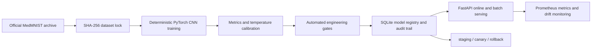

# NeuroVisionLab — operating a high-stakes ML model after training

NeuroVisionLab is a runnable, artifact-first **ML Systems / MLOps** project. It demonstrates the operational question that a notebook does not answer:

> How do we operate a high-stakes ML model reliably after training?

It acquires a legally usable MedMNIST benchmark, trains a real PyTorch image CNN, records immutable data/model lineage, evaluates release gates, serves a registry-selected model, observes inference behavior, and exercises a staged canary plus rollback.

**Important:** this is a research and engineering demonstration only. MedMNIST itself states it is not for clinical use. Nothing here is clinical validation, medical advice, a diagnosis, or a deployable clinical decision-support system.

## What is actually implemented


```mermaid
flowchart LR
  D[Official MedMNIST archive] --> L[SHA-256 dataset lock]
  L --> T[Deterministic PyTorch CNN training]
  T --> E[Metrics and temperature calibration]
  E --> G[Automated engineering gates]
  G --> R[SQLite model registry and audit trail]
  R --> S[FastAPI online and batch serving]
  S --> M[Prometheus metrics and drift monitoring]
  R --> C[staging / canary / rollback]
```

- Reproducible data acquisition: config-controlled official URL, split profile, SHA-256 lock, and content-derived data version. See [data card](docs/data_card.md).
- Real deep learning: a small PyTorch CNN trains directly on PneumoniaMNIST image tensors. It does not reuse the old NumPy fallback.
- Configured experiments: TOML controls source, bounded sample sizes, seed, optimizer/training parameters, gates, and canary percentage. Every run saves its resolved config fingerprint, Git SHA, environment, data lock, checkpoint hash, predictions, and metrics in `artifacts/mlops/runs/<run-id>/run.json`.
- Tracking and lineage: append-only `experiments.jsonl`, per-run manifest, content-addressed data lock, and SQLite registry provide inspectable lineage without requiring a hosted tracking server.
- Registry and safety workflow: `candidate`, `staging`, `production`, and `retired` states; gate-controlled registration/promotion; immutable audit events; deterministic traffic routing; shadow model execution; 10% canary; and restoration of the recorded previous production model.
- Evaluation and uncertainty: accuracy, macro F1, AUROC/PR-AUC where defined, confusion matrix, calibration temperature, expected calibration error (ECE), confidence, entropy, and review flags. See [model card](docs/model_card.md).
- Serving: FastAPI `POST /infer` (online) and `POST /infer/batch`; serving resolves the production registry state rather than the newest filesystem artifact.
- Monitoring: persisted online observations; input brightness PSI, prediction-distribution Jensen–Shannon divergence, confidence/review rate, p50/p95 latency, shadow disagreement, and accuracy/F1 only after delayed labels are submitted.
- Operations: Prometheus-compatible `GET /metrics`, a Grafana dashboard definition in [`dashboards/`](dashboards/neurovisionlab-mlops.json), production Docker image, Docker Compose, and Kubernetes deployment/service/HPA manifests.
- Quality gates: GitHub Actions runs lint, types, unit tests, a real data/model smoke train, and a container build.

## Run the full lifecycle

Prerequisites: Python 3.12 and a network connection for the first official MedMNIST download. CPU is sufficient; the demo is bounded to a small deterministic subset.

```powershell
python -m venv .venv
.\.venv\Scripts\Activate.ps1
pip install -r requirements.txt
python scripts/lifecycle_demo.py --config configs/demo.toml
```

That one command executes and prints evidence for:

```text
acquire + lock dataset
→ train real CNN (two independently versioned runs)
→ evaluate + calibrate + engineering gates
→ register candidate → staging → initial production
→ online + batch inference with a shadow candidate
→ delayed-label performance and drift monitoring
→ 10% deterministic canary → audited rollback
→ model-load, latency, throughput, monitoring, and rollout/rollback benchmarks
```

Artifacts stay local and ignored by Git under `artifacts/mlops/`; the final JSON report contains absolute paths to each run, data lock, and benchmark. The demo’s deliberately permissive thresholds prove lifecycle wiring, not model quality. Set defensible, independently reviewed engineering thresholds for a real deployment, and never mistake them for clinical acceptance criteria.

## Operate the service

```powershell
uvicorn app.main:app --host 0.0.0.0 --port 8000
```

After a lifecycle run, open `http://localhost:8000/docs`. The operational endpoints are:

| Endpoint | Purpose |
| --- | --- |
| `POST /infer` and `POST /infer/batch` | Registry-selected online and batch benchmark inference |
| `POST /lifecycle/register` | Register a gated run manifest as a candidate |
| `POST /lifecycle/promote` | Move candidate to staging or controlled production traffic |
| `POST /lifecycle/shadow` | Run a model in shadow without returning its prediction |
| `POST /lifecycle/feedback` | Attach a delayed benchmark label for performance monitoring |
| `POST /lifecycle/rollback` | Restore the recorded preceding production model |
| `GET /lifecycle/models` and `/lifecycle/audit` | State inventory and durable audit trail |
| `GET /lifecycle/monitoring` and `/metrics` | Monitoring JSON and Prometheus exposition |

The deployment reference lives in [`k8s/`](k8s/). It assumes a persistent artifact/registry volume and deliberately uses a placeholder image name—inspect and adapt it before deployment. The Kubernetes manifests have not been represented as a clinical deployment or cluster validation.

## Focused commands

```powershell
# Fetch/verify and create dataset.lock.json
python scripts/acquire_data.py --config configs/demo.toml

# Train one traceable real CNN run
python scripts/train_mlops.py --config configs/demo.toml

# Benchmark a currently registry-known production model using a saved PNG
python scripts/benchmark.py --model-id <model-id> --image <path-to-png>

# Containerized inference surface
docker compose up --build api
```

## Repository map

```text
app/mlops/             data lock, CNN training, gates, registry, serving, monitoring, benchmarks
app/api/lifecycle.py   registry, promotions, shadow, feedback, audit APIs
app/api/serving.py     online and batch inference APIs
configs/               reproducible TOML experiments (demo and CI smoke)
scripts/               acquisition, training, lifecycle demo, benchmark entry points
docs/                  data and model cards
dashboards/            Grafana-compatible dashboard JSON
k8s/                   deployment, service, config, and HPA reference manifests
.github/workflows/     lint, types, tests, real smoke train, Docker build
```

## Dataset and attribution

This project uses the official [MedMNIST](https://medmnist.com/) benchmark distribution, which documents standardized biomedical image datasets and licensing. Retain the dataset’s original attribution and consult its source-data citations for any use beyond this engineering demo.

## License

MIT. Dataset licensing and terms are separate; see the data card and MedMNIST materials.
